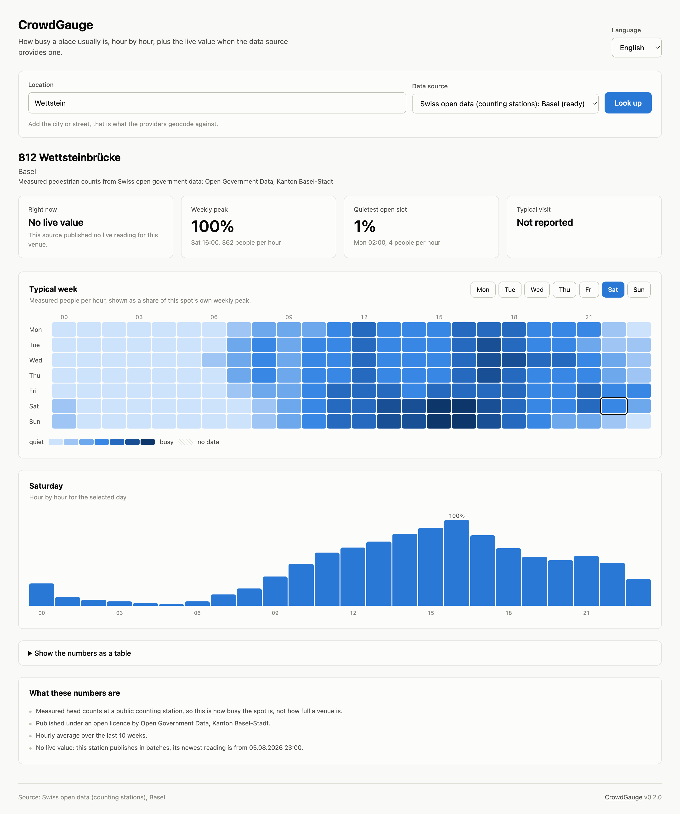

<div align="center">
  
  <h1>CrowdGauge</h1>
</div>

[🇩🇪 Deutsche Version](README.de.md)

**How busy a place usually is, hour by hour. Python, FastAPI, swappable footfall providers.**

CrowdGauge takes a location, asks a footfall data provider how busy that place typically is across
the week, and shows the result as a heatmap plus a live value where the source offers one. The
provider is an adapter, so the same interface works with Google based data, with an independent
phone signal panel, or with Swiss open government data that needs no account at all.

**It works out of the box.** Without any API key it queries public pedestrian counting stations,
which are real measurements published under an open licence, complete with actual head counts.

[](https://github.com/9t29zhmwdh-coder/CrowdGauge/actions/workflows/ci.yml) [](https://github.com/9t29zhmwdh-coder/CrowdGauge/actions/workflows/github-code-scanning/codeql) [](https://scorecard.dev/viewer/?uri=github.com/9t29zhmwdh-coder/CrowdGauge)
   

> **How it runs:** a local web server on `http://127.0.0.1:8734`, started with `crowdgauge serve`.
> No background service, no account, no telemetry. There is also a CLI mode that prints the week
> straight into the terminal.



---

**In practice:** you type a place, for example a gym or a supermarket, and you see at a glance when
it is quiet and when it is packed. If the data source has a live reading, you also see how busy it
is right now compared to a normal moment of that week. That is enough to decide whether to go now
or in two hours.

## What the numbers mean

Busyness is a **share of that place's own peak**. 100 means as busy as it ever gets, 40 means
clearly quieter than its own maximum. A busy corner bakery and a half empty stadium can both read
80, so the percentage compares a place with itself and never with another place.

Whether an actual number of people exists depends on the source. Google and BestTime only ever
publish the relative figure, and it cannot be converted into a head count. A public counting station
measures people directly, so with `opendata_ch` the interface additionally shows people per hour.

## Data sources

Neither Google nor Apple exposes this data through their official APIs. Google shows popular times
only in the Maps interface, and the feature request to expose it has been open since 2017
([issuetracker.google.com/issues/35827550](https://issuetracker.google.com/issues/35827550)). Apple
Maps has no equivalent field at all. CrowdGauge therefore talks to providers that license or measure
the data themselves, instead of scraping anyone.

| Provider | Data origin | Coverage | Live value | Cost at the time of writing |
|----------|-------------|----------|-----------|------------------------------|
| `opendata_ch` | Municipal pedestrian counters, measured head counts | Basel, more cities planned | when recent | free, no account |
| `serpapi` | Google Maps popular times, relayed under SerpApi's licence | worldwide | yes | 250 searches per month free, then from 25 USD |
| `besttime` | Independent panel of anonymised phone signals | 150+ countries | yes | credit based, free tier available |
| `demo` | Synthetic curves generated locally, no network access | anything | yes | free, always available |

Without a key the Swiss open data source answers, because a real measurement beats a synthetic one.
The demo provider remains as a last resort and labels every report it produces as synthetic, in the
interface and in the API response.

The open data source measures something different from the other two, and the interface says so:
a counting station records people passing a street cross section, so it answers "how busy is this
spot" rather than "how full is this restaurant". It is also the only source that reports actual
people per hour instead of a relative figure.

## Features

- Works with no configuration at all, on real measured data
- Weekly heatmap of 7 days by 24 hours, with the current hour marked
- Actual head counts per hour where the source measures them
- Live busyness including the difference to what is typical for that hour
- Quietest and busiest slots of the week, computed rather than eyeballed
- Provider abstraction: one adapter per source, selectable per request
- JSON API alongside the interface, so the data can feed other tools
- Terminal mode with sparklines, for use over SSH
- Interface in English and German, following the browser language
- Forecast responses cached in memory, live values always fetched fresh, which keeps provider
  credit use predictable

## Requirements

- Python 3.11 or newer
- No account and no API key for the Swiss open data source
- An API key for `serpapi` or `besttime`, optional, needed for venues outside the covered cities

## Quick Start

```bash
git clone https://github.com/9t29zhmwdh-coder/CrowdGauge.git
cd CrowdGauge
python3 -m venv .venv && source .venv/bin/activate
pip install -e .
crowdgauge serve
```

Then open `http://127.0.0.1:8734` and search for a counting station, for example `Wettstein`. No
key, no account, real measurements.

To look up arbitrary venues worldwide, add a provider key:

```bash
cp .env.example .env
# then edit .env and put in a SerpApi or BestTime key
```

Terminal mode:

```bash
crowdgauge lookup "Wettstein" --lang en      # real data, no key needed
crowdgauge lookup "Central Station, Zurich"  # needs a serpapi or besttime key
crowdgauge providers
```

## JSON API

| Endpoint | Purpose |
|----------|---------|
| `GET /api/health` | Version and the currently active provider |
| `GET /api/providers` | Which providers exist and which ones have credentials |
| `GET /api/search?q=` | Candidate venues for a query |
| `GET /api/busyness?q=` | Full report for the first matching venue |
| `GET /api/venues/{id}/busyness` | Report for a venue picked from a search result |

Every endpoint accepts an optional `provider` parameter. Interactive documentation is available at
`/docs` while the server runs.

## Configuration

All settings are environment variables with the prefix `CROWDGAUGE_`, and they can live in a `.env`
file next to the project. See `.env.example` for the full list. Keys are read into memory only,
never written to disk by the application and never included in an API response or an error message.

## Uninstall / Cleanup

```bash
pip uninstall crowdgauge
```

CrowdGauge writes no files outside its own directory: no database, no config in your home folder,
no cache on disk. The forecast cache lives in memory and disappears when the server stops. If you
created a `.env`, delete it to remove the API keys. If you cloned the repository, deleting the
folder removes everything that is left.

## Documentation

- [ARCHITECTURE.md](ARCHITECTURE.md), how the layers fit together and how to add a provider
- [SECURITY.md](SECURITY.md), reporting a vulnerability and the supply chain baseline
- [PRIVACY.md](PRIVACY.md), what leaves your machine and what does not
- [ROADMAP.md](ROADMAP.md), what is planned and what is deliberately out of scope
- [CHANGELOG.md](CHANGELOG.md), version history

---

**Author:** [Rafael Yilmaz](https://github.com/9t29zhmwdh-coder) · **Status:** Early Release ·  · **License:** MIT
